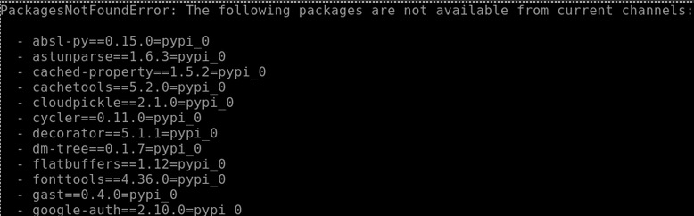

# Project Setup Docs

Credits to Nathan Keener for figuring the majority of this information out and providing the main body for this
documentation. Apologies in advance for the many inevitable "but it works on my machine" moments this will bring.

## Useful Links

- Optox library repo: https://github.com/VLOGroup/optox
- CUDA samples repo (if needed): https://github.com/nvidia/cuda-samples
- Conda package manager commands cheat-sheet:
https://docs.conda.io/projects/conda/en/4.6.0/_downloads/52a95608c49671267e40c689e0bc00ca/conda-cheatsheet.pdf

## Gateway Access & Tips

The SSH gateway to the mathcs-compute1 machine can be found at https://sshgw.duq.edu/#/. In the web interface, pressing
`CTRL+ALT+SHIFT` brings up a user menu where you can copy/paste between the terminal and your local clipboard.

### Pasting into the Terminal

- Open the user menu by pressing `CTRL+ALT+SHIFT`
- Paste from your local clipboard into the Clipboard text area of the menu
- Exit the menu by pressing `CTRL+ALT+SHIFT` again
- Paste what's in the Clipboard text area into the terminal by pressing `CTRL+SHIFT+V`

### Copying from the Terminal

- Highlight text using your mouse
- Open the user menu by pressing `CTRL+ALT+SHIFT`
- The highlighted text should appear in the Clipboard text area of the menu and can now be copied into your local
  clipboard like normal

## Environment Setup I: Conda Installation

[Conda](https://docs.conda.io/en/latest/) is a package manager used in many Python machine learning projects.
In Ryan’s Readme.md on his GitHub repo, he recommends using Conda to create a virtual environment.

There are a couple of different versions of Conda.  You should install
[Miniconda](https://docs.anaconda.com/miniconda/), because it is meant for command-line use and doesn’t include the
several GB of pre-installed packages that the other version includes. If the project gets access to a Linux GUI at some
point, installing the other version, Anaconda Distribution, may be a good idea.

Miniconda can be installed from the Linux command line: 
https://docs.anaconda.com/free/miniconda/#quick-command-line-install 

At the linked web page, switch over to the “Linux” panel, and run the four given commands. 

After running these commands, you’ll need to restart your shell, e.g., log out of the SSH gateway and log back in.
When you restart your shell, you should see that your shell prompt now begins with `(base)`, which indicates that
you are in the ‘base’ conda environment.

Whenever you need Git in your environment, you can easily install it with the command `conda install git`.

You can then Git clone this environment to your current working directory.

## Environment Setup II: Installing (Most) Dependencies

In the project files is the file `requirements.txt` which was exported from Ryan's Conda virtual environment (which is
the output of the command `conda list -e`). We can assume the packages in this list were the same packages he was using
in his own environment.

The standard procedure to create an environment from this list would be to run `conda create --name <name> --file 
requirements.txt`, and is also suggested within the file itself. **However, if you try to run this command, you will 
get a PackagesNotFoundError.**

Notice that all the missing packages end in `pypi_0`. This indicates that they were installed using pip instead of 
Conda. pip installs packages from the Python Package Index or PyPI repository. The `conda create` command cannot 
look for packages in this repository.

To fix this, we can instead create the Conda environment from a YAML file instead. If we had access to Ryan's 
original environment, we could easily export it as a YAML file, but we don't have that. Instead, Nathan found 
[this StackOverflow answer](https://stackoverflow.com/questions/70774618/conda-create-from-requirements-txt-not-finding-packages)
which provides the `list_export_to_yaml.awk` file which has already been included in this fork of Ryan's repo. To 
run the script, run `awk -f list_export_to_yaml.awk requirements.txt > environment.yaml` to generate our new YAML file.

To create a Conda environment from our YAML file, the command is slightly different: 
`conda env create --name <name> --file environment.yml`,  where `<name>` can be whatever you want the Conda 
environment to be named.

The step "installing pip dependencies" might take a while. This step properly installs the missing packages that weren't
found previously.

Once the environment has been created, you can tell Conda to use it with the command `conda activate <name>`.

## Environment Setup III: Other Dependencies

The most problematic dependency that we'll need is the optox library, but before we can install it, there are a few last
dependencies to take care of.

The optox library uses CMake in its build system, which can be installed with the command `conda install cmake`.

In one of Ryan's source files, `/denoising/models/denoising_models.py`, is the line `import yaml`. Strangely, 
there's no mention of Python YAML support in the `requirements.txt` file, but we'll need a YAML package or else the 
code won't run. The package Ryan used is *probably* PyYAML, which is the most popular one. I haven't run into any  
problems when using it, so you can install PyYAML with the command `conda install pyyaml`.

## Environment Setup IV: optox

As Ryan's ReadMe file explains, the only dependency that can't be installed through Conda or pip is the optox library.
To build it, you'll need to do it manually from the source from its repository. On the compute1 machine through the 
gateway, we had trouble using Git to clone the repo, so it was downloaded manually as a zip file and shared. I got 
it from Nathan's directory at `/home/keenern/optox-master.zip`. If you're not using the compute1 machine, this might 
not be a problem.

If you have the zip file, you can unzip it with the command `unzip optox-master` which will unzip its contents into 
your current working directory.

### The CUDA Samples

The optox library depends on a set of sample file provided with the CUDA Toolkit, which can be installed from 
https://developer.nvidia.com/cuda-toolkit-archive. However, these sample files were removed from the CUDA Toolkit from 
version 11.6 and onward. The samples are now in a separate repo that can be found at 
https://github.com/nvidia/cuda-samples. Like with optox, you might have trouble using Git on compute1. Hopefully, if 
you have Git in your Conda environment installed and compute1 is feeling generous, you can just clone the repository 
into the project.

If you have trouble, the files are in Nathan's directory at `/home/keenern/cuda-samples-master.zip`. Use the command 
`unzip cuda-samples-master` to unzip it into your current working directory. They don't have to be inside the 
project itself, but it's probably more convenient to keep everything together.

Ryan provides a script to install optox that is meant to be an example. It can be found in the repo as 
`install_optox.sh`. This script directly uses Git to clone the repo, but this won't work on compute1. Included in 
this repo is the `install_optox_new.sh` script which avoids this.

Make sure to change line 8 of the `install_optox_new.sh` file to the path of where you unzipped the CUDA files.

In the unzipped optox-master folder, the file CMakeLists.txt is outdated and needs a slight tweak. It expects the 
CUDA samples to be found at `/common/inc`, but the repo has changed so that they are at `/Common` instead. On line 30, 
change `/common/inc` to `/Common`.

### Running the Installation Script

Assuming you modified the `install_optox_new.sh` script to where the files are in your machine and the CMakeLists.
txt file in the optox directory has been updated, you should be able to run the script with the command 
`sh install_optox_new.sh`. Hopefully, the installation script works and all tests pass!

If the installation runs into an error at around 50%, the usual cause is that the path in `install_optox_new.sh` 
starting with `export CUDA_SDK_ROOT_DIR=` is incorrect. Ensure that the path directs to where the CUDA samples are 
located in your project.

## Final Testing

At this point, the environment should be complete. We have a Conda environment with all of Ryan's dependencies, and 
the optox library has been built from source.

**To correctly run Python, make sure to use the command `export PYTHONPATH="${PYTHONPATH}:$PWD"` in the project's 
top-level directory. Running this command outside the top-level project folder (or forgetting to run it) will 
leave Python files unable to import the other files of the project.**

In Ryan's ReadME.md are basic instructions to load training data by calling `python3 data/load_data.py` from the 
top-level directory. This attempts to download the training data, but this usually results in a 403 error on compute1.
For convenience (and also because the URL it downloads from seems to no longer be in use) I've added them to the 
repo in the correct location.

Once the training data has been downloaded, you can test that everything is working correctly by running 
`python3 reproduce/test/test.py` from the top-level directory. If no errors occur, then everything has been installed!
