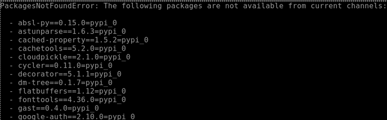

# Project Setup Docs

Credits to Nathan Keener for figuring the majority of this information out and providing the main body for this
documentation.

## Useful Links

- Optox library repo: https://github.com/VLOGroup/optox
- CUDA samples repo (if needed): https://github.com/nvidia/cuda-samples
- Conda package manager commands cheat-sheet:
https://docs.conda.io/projects/conda/en/4.6.0/_downloads/52a95608c49671267e40c689e0bc00ca/conda-cheatsheet.pdf

## Gateway Access & Tips

The SSH gateway to the mathcs-compute1 machine can be found at https://sshgw.duq.edu/#/. In the web interface, pressing
`CTRL+ALT+SHIFT` brings up a user menu where you can copy/paste between the terminal and your local clipboard.

### Pasting into the Terminal

- Open the user menu by pressing `CTRL+ALT+SHIFT`
- Paste from your local clipboard into the Clipboard text area of the menu
- Exit the menu by pressing `CTRL+ALT+SHIFT` again
- Paste what's in the Clipboard text area into the terminal by pressing `CTRL+SHIFT+V`

### Copying from the Terminal

- Highlight text using your mouse
- Open the user menu by pressing `CTRL+ALT+SHIFT`
- The highlighted text should appear in the Clipboard text area of the menu and can now be copied into your local
  clipboard like normal

## Environment Setup I: Conda Installation

[Conda](https://docs.conda.io/en/latest/) is a package manager used in many Python machine learning projects.
In Ryan’s Readme.md on his GitHub repo, he recommends using Conda to create a virtual environment.

There are a couple of different versions of Conda.  You should install
[Miniconda](https://docs.anaconda.com/miniconda/), because it is meant for command-line use and doesn’t include the
several GB of pre-installed packages that the other version includes. If the project gets access to a Linux GUI at some
point, installing the other version, Anaconda Distribution, may be a good idea.

Miniconda can be installed from the Linux command line: 
https://docs.anaconda.com/free/miniconda/#quick-command-line-install 

At the linked web page, switch over to the “Linux” panel, and run the four given commands. 

After running these commands, you’ll need to restart your shell, e.g., log out of the SSH gateway and log back in.
When you restart your shell, you should see that your shell prompt now begins with `(base)`, which indicates that
you are in the ‘base’ conda environment.

## Environment Setup II: Installing (Most) Dependencies

In the project files is the file `requirements.txt` which was exported from Ryan's Conda virtual environment (which is
the output of the command `conda list -e`). We can assume the packages in this list were the same packages he was using
in his own environment.

The standard procedure to create an environment from this list would be to run `conda create --name <name> --file 
requirements.txt`, and is also suggested within the file itself. **However, if you try to run this command, you will 
get a PackagesNotFoundError.**

Notice that all the missing packages end in `pypi_0`. This indicates that they were installed using pip instead of 
Conda. pip installs packages from the Python Package Index or PyPI repository. The `conda create` command cannot 
look for packages in this repository.

To fix this, we can instead create the Conda environment from a YAML file instead. If we had access to Ryan's 
original environment, we could easily export it as a YAML file, but we don't have that. Instead, Nathan found 
[this StackOverflow answer](https://stackoverflow.com/questions/70774618/conda-create-from-requirements-txt-not-finding-packages)
which provides the `list_export_to_yaml.awk` file which has already been included in this fork of Ryan's repo. To 
run the script, run `awk -f list_export_to_yaml.awk requirements.txt > environment.yaml` to generate our new YAML file.

To create a Conda environment from our YAML file, the command is slightly different: 
`conda env create --name <name> --file environment.yml`,  where `<name>` can be whatever you want the Conda 
environment to be named.

The step "installing pip dependencies" might take a while. This step properly installs the missing packages that weren't
found previously.

Once the environment has been created, you can tell Conda to use it with the command `conda activate <name>`.
